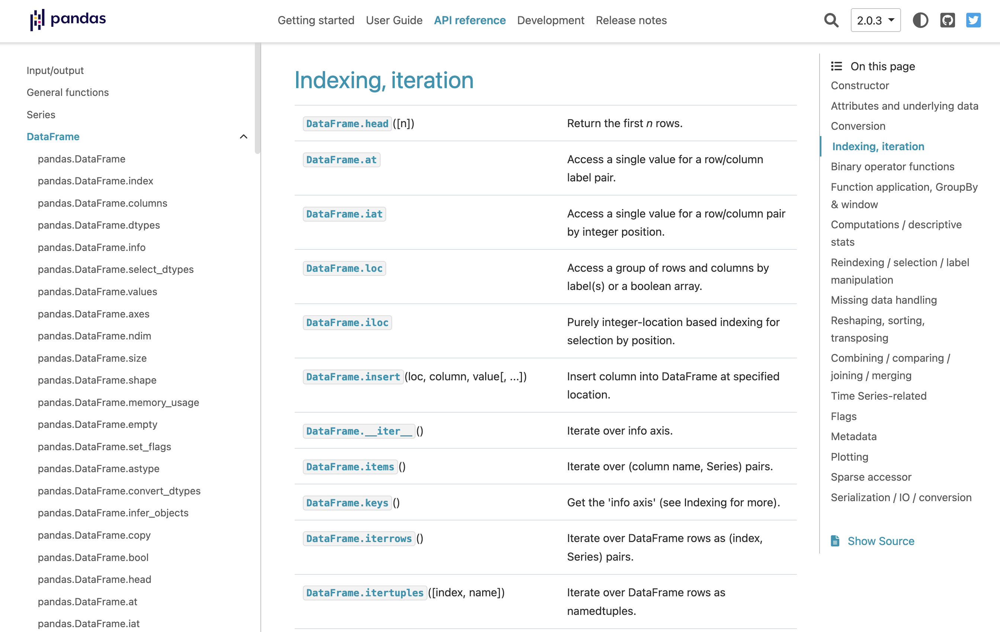

# Introduction to Pandas

Pandas is a powerful, open-source Python library for data analysis and manipulation. It is widely used in data science, statistics, and machine learning. This lecture introduces the essential features of pandas, focusing on practical examples and common operations.

## Learning Objectives

By the end of this lecture, students should be able to:

- Explain the difference between a pandas `Series` and `DataFrame`.
- Create a DataFrame manually and read tabular data from a CSV file.
- Select rows and columns using column names, `.loc`, and `.iloc`.
- Filter rows using Boolean conditions, string matching, and membership tests.
- Create and transform columns using arithmetic operations and custom functions.
- Compute descriptive statistics, value counts, correlations, and covariance.
- Sort DataFrames and chain common pandas operations.

## Prerequisites

Before you start, make sure you have imported the necessary libraries:

```python
import numpy as np
import pandas as pd
```

## Pandas Documentation

Pandas is updated regularly. Always check your Python and pandas versions, as some features may change or become deprecated. Developing the skill to read and use the pandas documentation is essential for your learning and future work.

- **User Guide**: [https://pandas.pydata.org/docs/user_guide/index.html](https://pandas.pydata.org/docs/user_guide/index.html)
- **API Reference**: [https://pandas.pydata.org/docs/reference/index.html#api](https://pandas.pydata.org/docs/reference/index.html#api)



---

## Series

A `Series` is a one-dimensional array-like object containing a sequence of values and an associated array of data labels, called its *index*. The values are typically of a similar type (like NumPy arrays). The simplest Series is created from just an array of data:

```python
obj = pd.Series([4, 7, -5, 3])

print(obj)

# 0    4
# 1    7
# 2   -5
# 3    3
# dtype: int64
```

You can use NumPy functions or NumPy-like operations (such as filtering with a Boolean array, scalar multiplication, or applying math functions) on a Series, and the index-value relationship will be preserved:

```python
obj[obj > 0]

# 0    4
# 1    7
# 3    3
# dtype: int64
```

---

## DataFrame

A `DataFrame` is a two-dimensional, tabular data structure with labeled axes (rows and columns). Each column can have a different data type (numeric, string, Boolean, etc.). Think of a DataFrame as a dictionary of Series objects that all share the same index.

### Create DataFrame

One common way to construct a DataFrame is from a dictionary of equal-length lists or NumPy arrays. The resulting DataFrame will have its index assigned automatically, and the columns are placed according to the order of the keys in `data`:

```python
data = {"state": ["Ohio", "Ohio", "Ohio", "Nevada", "Nevada", "Nevada"],
        "year": [2000, 2001, 2002, 2001, 2002, 2003],
        "pop": [1.5, 1.7, 3.6, 2.4, 2.9, 3.2]}
df = pd.DataFrame(data)

print(df)

# state  year  pop
# 0    Ohio  2000  1.5
# 1    Ohio  2001  1.7
# 2    Ohio  2002  3.6
# 3  Nevada  2001  2.4
# 4  Nevada  2002  2.9
# 5  Nevada  2003  3.2
```

The `df` above contains the following table:

| state  | year | pop |
|--------|------|-----|
| Ohio   | 2000 | 1.5 |
| Ohio   | 2001 | 1.7 |
| Ohio   | 2002 | 3.6 |
| Nevada | 2001 | 2.4 |
| Nevada | 2002 | 2.9 |
| Nevada | 2003 | 3.2 |

A DataFrame can also be created by loading data from external sources, such as reading a CSV file or retrieving data from a SQL database.

```python
df_from_csv = pd.read_csv('https://people.sc.fsu.edu/~jburkardt/data/csv/hw_200.csv')
```

Once created, columns can be modified by assignment. For example:

```python
df['year'] = 1989

print(df)

#     state  year  pop
# 0    Ohio  1989  1.5
# 1    Ohio  1989  1.7
# 2    Ohio  1989  3.6
# 3  Nevada  1989  2.4
# 4  Nevada  1989  2.9
# 5  Nevada  1989  3.2
```

You can also assign different values for each row using a NumPy array or list. Just make sure that the number of elements matches the number of rows in the DataFrame.

```python
df['pop'] = np.arange(len(df))

print(df)

#     state  year  pop
# 0    Ohio  1989    0
# 1    Ohio  1989    1
# 2    Ohio  1989    2
# 3  Nevada  1989    3
# 4  Nevada  1989    4
# 5  Nevada  1989    5
```

---

### Types of Data

Understanding data types is essential for effective data analysis. Here are the main types of data you will encounter in pandas, along with examples:

#### 1. Categorical

Categorical data represents labels or names that identify distinct groups or categories. These values do not have a mathematical meaning.

**Examples:**

- Gender: `["Male", "Female", "Other"]`
- Product type: `["Book", "Electronics", "Clothing"]`
- Country: `["USA", "Thailand", "Japan"]`

```python
import pandas as pd

df = pd.DataFrame({
        "gender": ["Male", "Female", "Female", "Male"],
        "product": ["Book", "Electronics", "Book", "Clothing"]
})
print(df["gender"].dtype)  # object (string/categorical)
```

#### 2. Numerical

Numerical data consists of numbers and can be either discrete (countable) or continuous (measurable).

- **Discrete:** Countable values (e.g., number of items)
- **Continuous:** Any value within a range (e.g., height, weight)

**Examples:**

- Age: `[21, 35, 42, 19]`
- Price: `[19.99, 5.50, 100.00]`
- Number of purchases: `[1, 3, 2, 5]`

```python
df = pd.DataFrame({
        "age": [21, 35, 42, 19],
        "price": [19.99, 5.50, 100.00, 7.25]
})
print(df["age"].dtype)    # int64
print(df["price"].dtype)  # float64
```

#### 3. Ordinal

Ordinal data represents categories with a meaningful order, but the intervals between categories are not necessarily equal.

**Examples:**

- Education level: `["High School", "Bachelor", "Master", "PhD"]`
- Satisfaction: `["Low", "Medium", "High"]`

```python
education_levels = pd.Categorical(
        ["Bachelor", "PhD", "Master", "High School"],
        categories=["High School", "Bachelor", "Master", "PhD"],
        ordered=True
)
df = pd.DataFrame({"education": education_levels})
print(df["education"])
```

#### 4. Boolean

Boolean data represents logical values: `True` or `False`.

**Examples:**

- Is student: `[True, False, True, False]`
- Purchased: `[False, True, False, True]`

```python
df = pd.DataFrame({
        "is_student": [True, False, True, False],
        "purchased": [False, True, False, True]
})
print(df["is_student"].dtype)  # bool
```

---

**Summary Table**

| Type        | Description                        | Example Values                |
|-------------|------------------------------------|-------------------------------|
| Categorical | Labels or names                    | "Male", "Book", "USA"         |
| Numerical   | Real numbers (discrete/continuous) | 21, 19.99, 5                  |
| Ordinal     | Ordered categories                 | "Low", "Medium", "High"       |
| Boolean     | True/False values                  | True, False                   |

---

## Select Columns

You can select columns using their names:

```python
print(df['state'])

# 0      Ohio
# 1      Ohio
# 2      Ohio
# 3    Nevada
# 4    Nevada
# 5    Nevada
# Name: state, dtype: object

print(df[['state','pop']])

#     state  pop
# 0    Ohio    0
# 1    Ohio    1
# 2    Ohio    2
# 3  Nevada    3
# 4  Nevada    4
# 5  Nevada    5

print(df[['pop','year']])

#    pop  year
# 0    0  1989
# 1    1  1989
# 2    2  1989
# 3    3  1989
# 4    4  1989
# 5    5  1989
```

---

## Select Rows and Columns

Pandas provides `.loc` and `.iloc` for label-based and position-based indexing, respectively. Since DataFrame is two-dimensional, you can select a subset of the rows and columns using either axis labels (`loc`) or integer positions (`iloc`).

Select rows using index labels with the `loc` operator:

```python
data = {"state": ["Ohio", "Ohio", "Ohio", "Nevada", "Nevada", "Nevada"],
        "year": [2000, 2001, 2002, 2001, 2002, 2003],
        "pop": [1.5, 1.7, 3.6, 2.4, 2.9, 3.2]}
df = pd.DataFrame(data)

print(df.loc[[0,3,4,5]])

#     state  year  pop
# 0    Ohio  2000  1.5
# 3  Nevada  2001  2.4
# 4  Nevada  2002  2.9
# 5  Nevada  2003  3.2
```

Here is another example with a DataFrame whose index labels are **not** numbers:

```python
df2 = pd.DataFrame(np.arange(16).reshape((4, 4)),
                    index=["Ohio", "Colorado", "Utah", "New York"],
                    columns=["one", "two", "three", "four"])

print(df2)

#           one  two  three  four
# Ohio        0    1      2     3
# Colorado    4    5      6     7
# Utah        8    9     10    11
# New York   12   13     14    15

print(df2.loc[["Ohio","Utah"]])

#       one  two  three  four
# Ohio    0    1      2     3
# Utah    8    9     10    11
```

Select rows and columns with `loc` by separating the selection with a comma (`,`):

```python
print(df.loc[:,['year','pop']])

#    year  pop
# 0  2000  1.5
# 1  2001  1.7
# 2  2002  3.6
# 3  2001  2.4
# 4  2002  2.9
# 5  2003  3.2

print(df.loc[[0,3,4],['year','pop']])

#    year  pop
# 0  1989    0
# 3  1989    3
# 4  1989    4

print(df.loc[2:4,['year','pop']])

#    year  pop
# 2  1989    2
# 3  1989    3
# 4  1989    4
```

Note that `.loc` slicing with labels includes both endpoints. In this example, `2:4` includes labels `2`, `3`, and `4`.

Select rows using positions (similar to row number, but starting from 0) with the `iloc` operator:

```python
print(df.iloc[1])

# state    Ohio
# year     1989
# pop         1
# Name: 1, dtype: object

print(df.iloc[[2, 1]])

#   state  year  pop
# 2  Ohio  1989    2
# 1  Ohio  1989    1

print(df.iloc[1, 2])

# 1

print(df.iloc[2, [2,0,1]])

# pop         2
# state    Ohio
# year     1989
# Name: 2, dtype: object

print(df.iloc[[2,0], 0:1])

#   state
# 2  Ohio
# 0  Ohio
```

Unlike `.loc`, `.iloc` uses normal Python-style slicing, so the endpoint is excluded. For example, `0:1` selects only position `0`.

Select rows based on conditions:

```python
print(df[df['pop'] > 2])

#     state  year  pop
# 3  Nevada  1989    3
# 4  Nevada  1989    4
# 5  Nevada  1989    5

print(df[(df['pop'] > 2) & (df['pop'] < 5)])

#     state  year  pop
# 3  Nevada  1989    3
# 4  Nevada  1989    4

print(df[(df['pop'] < 2) | (df['pop'] > 4)])

#     state  year  pop
# 0    Ohio  1989    0
# 1    Ohio  1989    1
# 5  Nevada  1989    5

print(df.iloc[:, 1:][df['pop'] > 2])

#    year  pop
# 3  1989    3
# 4  1989    4
# 5  1989    5
```

An aligned boolean Series can be used directly with `loc`. For `iloc`, use a
position-based boolean array such as `mask.to_numpy()` rather than a Series
whose index labels could be misinterpreted:

```python
print(df.loc[df['pop'] > 2])

#     state  year  pop
# 3  Nevada  1989    3
# 4  Nevada  1989    4
# 5  Nevada  1989    5
```

Select rows based on whether a string column contains a substring, using `str.contains`:

```python
data = {"state": ["Ohio", "New York", "Ohio", "Nevada", "Chicago", "Califonia"],
        "year": [2000, 2001, 2002, 2001, 2002, 2003],
        "pop": [1.5, 1.7, 3.6, 2.4, 2.9, 3.2]}
df = pd.DataFrame(data)

print(df)

#        state  year  pop
# 0       Ohio  2000  1.5
# 1   New York  2001  1.7
# 2       Ohio  2002  3.6
# 3     Nevada  2001  2.4
# 4    Chicago  2002  2.9
# 5  Califonia  2003  3.2

mask = df['state'].str.contains('hi')

print(mask)

# 0     True
# 1     True
# 2     True
# 3    False
# 4    False
# 5    False
# Name: state, dtype: bool

print(df[mask])
# print(df[df['state'].str.contains('hi')])

#      state  year  pop
# 0     Ohio  2000  1.5
# 2     Ohio  2002  3.6
# 4  Chicago  2002  2.9

print(df[df['state'].str.contains('vad')])

#     state  year  pop
# 3  Nevada  2001  2.4

print(df[df['state'].str.contains('Ohio')])

#   state  year  pop
# 0  Ohio  2000  1.5
# 2  Ohio  2002  3.6
```

Select rows based on whether column values are in a provided list, using `isin`:

```python
mask = df['state'].isin(['Ohio', 'New York'])

print(mask)

# 0     True
# 1     True
# 2     True
# 3    False
# 4    False
# 5    False
# Name: state, dtype: bool

print(df[mask])
# print(df[df['state'].isin(['Ohio', 'New York'])])

#       state  year  pop
# 0      Ohio  2000  1.5
# 1  New York  2001  1.7
# 2      Ohio  2002  3.6

print(df[df['state'].isin(['Bangkok'])])

# Empty DataFrame
# Columns: [state, year, pop]
# Index: []

print(df[df['year'].isin([2000,2002])])

#      state  year  pop
# 0     Ohio  2000  1.5
# 2     Ohio  2002  3.6
# 4  Chicago  2002  2.9
```

Here is an example of a more complex selection:

```python
print(df[(~df['state'].isin(['New York', 'Chicago'])) & (df['year'] > 2001)])

#        state  year  pop
# 2       Ohio  2002  3.6
# 5  Califonia  2003  3.2
```

There are many ways to select and rearrange the data contained in a pandas object. For DataFrame, the table below provides a short summary of many of them. As you will see later, there are additional options for working with hierarchical indexes.

Indexing options with DataFrame.

| **Type** | **Notes** |
| --- | --- |
| `df[column]` | Select single column or sequence of columns from the DataFrame |
| `df.loc[rows]` | Select single row or subset of rows from the DataFrame by label |
| `df.loc[:, cols]` | Select single column or subset of columns by label |
| `df.loc[rows, cols]` | Select both row(s) and column(s) by label |
| `df.iloc[rows]` | Select single row or subset of rows from the DataFrame by integer position |
| `df.iloc[:, cols]` | Select single column or subset of columns by integer position |
| `df.iloc[rows, cols]` | Select both row(s) and column(s) by integer position |
| `df.at[row, col]` | Select a single scalar value by row and column label |
| `df.iat[row, col]` | Select a single scalar value by row and column position (integers) |

---

## Drop Columns

To drop columns, use `df.drop` and specify the column names in the `columns` argument:

```python
data = {"state": ["Ohio", "Ohio", "Ohio", "Nevada", "Nevada", "Nevada"],
        "year": [2000, 2001, 2002, 2001, 2002, 2003],
        "pop": [1.5, 1.7, 3.6, 2.4, 2.9, 3.2]}
df = pd.DataFrame(data)

print(df.drop(columns=['pop']))

# state  year
# 0    Ohio  2000
# 1    Ohio  2001
# 2    Ohio  2002
# 3  Nevada  2001
# 4  Nevada  2002
# 5  Nevada  2003
```

```python
print(df.drop(columns=['pop','state']))

# year
# 0  2000
# 1  2001
# 2  2002
# 3  2001
# 4  2002
# 5  2003
```

---

## Arithmetic Operations

You can create a new column from an existing column:

```python
data = {"state": ["Ohio", "Ohio", "Ohio", "Nevada", "Nevada", "Nevada"],
        "year": [2000, 2001, 2002, 2001, 2002, 2003],
        "pop": [1.5, 1.7, 3.6, 2.4, 2.9, 3.2]}
df = pd.DataFrame(data)

print(df)

#     state  year  pop
# 0    Ohio  2000  1.5
# 1    Ohio  2001  1.7
# 2    Ohio  2002  3.6
# 3  Nevada  2001  2.4
# 4  Nevada  2002  2.9
# 5  Nevada  2003  3.2

df['pop_sq'] = df['pop'] ** 2

print(df)

#     state  year  pop  pop_sq
# 0    Ohio  2000  1.5    2.25
# 1    Ohio  2001  1.7    2.89
# 2    Ohio  2002  3.6   12.96
# 3  Nevada  2001  2.4    5.76
# 4  Nevada  2002  2.9    8.41
# 5  Nevada  2003  3.2   10.24
```

You can also apply operations between columns:

```python
df['pop_sum'] = df['pop_sq'] + df['pop']

print(df)

#     state  year  pop  pop_sq  pop_sum
# 0    Ohio  2000  1.5    2.25     3.75
# 1    Ohio  2001  1.7    2.89     4.59
# 2    Ohio  2002  3.6   12.96    16.56
# 3  Nevada  2001  2.4    5.76     8.16
# 4  Nevada  2002  2.9    8.41    11.31
# 5  Nevada  2003  3.2   10.24    13.44
```

---

## Apply a Custom Function

NumPy universal functions (ufuncs, i.e., element-wise array methods) also work with pandas objects:

```python
df = pd.DataFrame(np.random.standard_normal((4, 3)),
                  columns=list("bde"),
                  index=["Utah", "Ohio", "Texas", "Oregon"])

print(df)

#                b         d         e
# Utah   -0.588526 -0.111549 -0.690939
# Ohio    0.398434 -0.221185 -1.284207
# Texas   1.032436  0.049124 -0.423960
# Oregon -0.055095 -0.610482 -1.913077

print(np.abs(df))

#                b         d         e
# Utah    0.588526  0.111549  0.690939
# Ohio    0.398434  0.221185  1.284207
# Texas   1.032436  0.049124  0.423960
# Oregon  0.055095  0.610482  1.913077
```

Another frequent operation is applying a function to each column or row. DataFrame’s `apply` method does exactly this:

```python
def f1(x):
    return x.max() - x.min()

print(df.apply(f1))

# b    1.620962
# d    0.659606
# e    1.489118
# dtype: float64
```

Here, the function `f1`, which computes the difference between the maximum and minimum of a Series, is invoked once on each column in `df`. The result is a Series having the columns of `df` as its index.

If you pass `axis="columns"` to `apply`, the function will be invoked once per row instead. A helpful way to think about this is as “apply across the columns” (i.e., row-wise):

```python
print(df.apply(f1, axis="columns"))

# Utah      0.579390
# Ohio      1.682641
# Texas     1.456395
# Oregon    1.857982
# dtype: float64
```

Many of the most common array statistics (like `sum` and `mean`) are DataFrame methods, so using `apply` is not always necessary.

The function passed to `apply` need not return a scalar value; it can also return a Series with multiple values (for example, min and max):

```python
def f2(x):
    return pd.Series([x.min(), x.max()], index=["min", "max"])

print(df.apply(f2))

#             b         d         e
# min -0.588526 -0.610482 -1.913077
# max  1.032436  0.049124 -0.423960
```

---

## Sorting

Sorting a dataset by some criterion is another important built-in operation. When sorting a DataFrame, you can use the data in one or more columns as the sort keys. To do so, pass one or more column names to `sort_values`:

```python
data = {"state": ["Ohio", "Ohio", "Ohio", "Nevada", "Nevada", "Nevada"],
        "year": [2000, 2001, 2002, 2001, 2002, 2003],
        "pop": [1.5, 1.7, 3.6, 2.4, 2.9, 3.2]}
df = pd.DataFrame(data)

print(df.sort_values(by='year'))

#     state  year  pop
# 0    Ohio  2000  1.5
# 1    Ohio  2001  1.7
# 3  Nevada  2001  2.4
# 2    Ohio  2002  3.6
# 4  Nevada  2002  2.9
# 5  Nevada  2003  3.2

print(df.sort_values(by=['pop','year']))

#     state  year  pop
# 0    Ohio  2000  1.5
# 1    Ohio  2001  1.7
# 3  Nevada  2001  2.4
# 4  Nevada  2002  2.9
# 5  Nevada  2003  3.2
# 2    Ohio  2002  3.6
```

The data is sorted in ascending order by default, but can be sorted in descending order by setting `ascending=False`:

```python
print(df.sort_values(by='year', ascending=False))

#     state  year  pop
# 5  Nevada  2003  3.2
# 2    Ohio  2002  3.6
# 4  Nevada  2002  2.9
# 1    Ohio  2001  1.7
# 3  Nevada  2001  2.4
# 0    Ohio  2000  1.5

print(df.sort_values(by=['pop','year'], ascending=[False, True]))

#     state  year  pop
# 2    Ohio  2002  3.6
# 5  Nevada  2003  3.2
# 4  Nevada  2002  2.9
# 3  Nevada  2001  2.4
# 1    Ohio  2001  1.7
# 0    Ohio  2000  1.5
```

---

## Summarizing and Computing Descriptive Statistics

Pandas objects are equipped with a set of common mathematical and statistical methods. Most of these fall into the category of *reductions* or *summary statistics*, methods that extract a single value (like the sum or mean) from a Series, or a Series of values from the rows or columns of a DataFrame. Compared with similar methods found on NumPy arrays, pandas methods have built-in handling for missing data. Consider a small DataFrame:

```python
df = pd.DataFrame(
    [
      [1.4, np.nan],
      [7.1, -4.5],
      [np.nan, np.nan],
      [0.75, -1.3]
    ],
    columns=["one", "two"])

print(df)

#     one  two
# 0  1.40  NaN
# 1  7.10 -4.5
# 2   NaN  NaN
# 3  0.75 -1.3
```

Calling DataFrame’s `sum` method returns a Series containing column sums:

```python
print(df.sum())

# one    9.25
# two   -5.80
# dtype: float64
```

Passing `axis="columns"` or `axis=1` sums across the columns instead:

```python
print(df.sum(axis="columns"))

# 0    1.40
# 1    2.60
# 2    0.00
# 3   -0.55
# dtype: float64
```

When an entire row or column contains all NA values, the sum is 0, whereas if any value is not NA, then the result is NA. This can be disabled with the `skipna` option, in which case any NA value in a row or column makes the corresponding result NA:

```python
print(df.sum(axis="index", skipna=False))

# one   NaN
# two   NaN
# dtype: float64

print(df.sum(axis="columns", skipna=False))

# 0     NaN
# 1    2.60
# 2     NaN
# 3   -0.55
# dtype: float64
```

Some aggregations, like `mean`, require at least one non-NA value to yield a result:

```python
print(df.mean(axis="columns"))

# 0    1.400
# 1    1.300
# 2      NaN
# 3   -0.275
# dtype: float64
```

Other methods are accumulations:

```python
print(df.cumsum())

#     one  two
# 0  1.40  NaN
# 1  8.50 -4.5
# 2   NaN  NaN
# 3  9.25 -5.8
```

Some methods are neither reductions nor accumulations. `describe` is one such example, producing multiple summary statistics in one shot:

```python
print(df.describe())

#             one       two
# count  3.000000  2.000000
# mean   3.083333 -2.900000
# std    3.493685  2.262742
# min    0.750000 -4.500000
# 25%    1.075000 -3.700000
# 50%    1.400000 -2.900000
# 75%    4.250000 -2.100000
# max    7.100000 -1.300000
```

Descriptive and summary statistics:

| **Method** | **Description** |
| --- | --- |
| `count` | Number of non-NA values |
| `describe` | Compute set of summary statistics |
| `min, max` | Compute minimum and maximum values |
| `argmin, argmax` | Compute index locations (integers) at which minimum or maximum value is obtained, respectively; not available on DataFrame objects |
| `idxmin, idxmax` | Compute index labels at which minimum or maximum value is obtained, respectively |
| `quantile` | Compute sample quantile ranging from 0 to 1 (default: 0.5) |
| `sum` | Sum of values |
| `mean` | Mean of values |
| `median` | Arithmetic median (50% quantile) of values |
| `prod` | Product of all values |
| `var` | Sample variance of values |
| `std` | Sample standard deviation of values |
| `skew` | Sample skewness (third moment) of values |
| `kurt` | Sample kurtosis (fourth moment) of values |
| `cumsum` | Cumulative sum of values |
| `cummin, cummax` | Cumulative minimum or maximum of values, respectively |
| `cumprod` | Cumulative product of values |
| `diff` | Compute first arithmetic difference (useful for time series) |
| `pct_change` | Compute percent changes |

---

## Correlation and Covariance

Some summary statistics, like correlation and covariance, are computed from pairs of columns. Let’s consider some DataFrames of stock prices and volumes originally obtained from Yahoo! Finance and available in binary Python pickle files you can find in the accompanying datasets for the book:

```python
price_df = pd.read_pickle("yahoo_price.pkl")
volume_df = pd.read_pickle("yahoo_volume.pkl")

print(price_df)

#                   AAPL        GOOG         IBM       MSFT
# Date                                                     
# 2010-01-04   27.990226  313.062468  113.304536  25.884104
# 2010-01-05   28.038618  311.683844  111.935822  25.892466
# 2010-01-06   27.592626  303.826685  111.208683  25.733566
# 2010-01-07   27.541619  296.753749  110.823732  25.465944
# 2010-01-08   27.724725  300.709808  111.935822  25.641571
# ...                ...         ...         ...        ...
# 2016-10-17  117.550003  779.960022  154.770004  57.220001
# 2016-10-18  117.470001  795.260010  150.720001  57.660000
# 2016-10-19  117.120003  801.500000  151.259995  57.529999
# 2016-10-20  117.059998  796.969971  151.520004  57.250000
# 2016-10-21  116.599998  799.369995  149.630005  59.660000

# [1714 rows x 4 columns]

print(volume_df)

#                  AAPL      GOOG       IBM      MSFT
# Date                                               
# 2010-01-04  123432400   3927000   6155300  38409100
# 2010-01-05  150476200   6031900   6841400  49749600
# 2010-01-06  138040000   7987100   5605300  58182400
# 2010-01-07  119282800  12876600   5840600  50559700
# 2010-01-08  111902700   9483900   4197200  51197400
# ...               ...       ...       ...       ...
# 2016-10-17   23624900   1089500   5890400  23830000
# 2016-10-18   24553500   1995600  12770600  19149500
# 2016-10-19   20034600    116600   4632900  22878400
# 2016-10-20   24125800   1734200   4023100  49455600
# 2016-10-21   22384800   1260500   4401900  79974200

# [1714 rows x 4 columns]
```

Compute percent changes of the prices:

```python
returns = price_df.pct_change()

print(returns)

#                 AAPL      GOOG       IBM      MSFT
# Date                                              
# 2010-01-04       NaN       NaN       NaN       NaN
# 2010-01-05  0.001729 -0.004404 -0.012080  0.000323
# 2010-01-06 -0.015906 -0.025209 -0.006496 -0.006137
# 2010-01-07 -0.001849 -0.023280 -0.003462 -0.010400
# 2010-01-08  0.006648  0.013331  0.010035  0.006897
# ...              ...       ...       ...       ...
# 2016-10-17 -0.000680  0.001837  0.002072 -0.003483
# 2016-10-18 -0.000681  0.019616 -0.026168  0.007690
# 2016-10-19 -0.002979  0.007846  0.003583 -0.002255
# 2016-10-20 -0.000512 -0.005652  0.001719 -0.004867
# 2016-10-21 -0.003930  0.003011 -0.012474  0.042096

# [1714 rows x 4 columns]
```

The `corr` method of Series computes the correlation of the overlapping, non-NA, aligned-by-index values in two Series. Relatedly, `cov` computes the covariance:

```python
print(returns["MSFT"].corr(returns["IBM"]))
# 0.49976361144151144

print(returns["MSFT"].cov(returns["IBM"]))
# 8.870655479703546e-05
```

DataFrame’s `corr` and `cov` methods, on the other hand, return a full correlation or covariance matrix as a DataFrame, respectively:

```python
print(returns.corr())

#           AAPL      GOOG       IBM      MSFT
# AAPL  1.000000  0.407919  0.386817  0.389695
# GOOG  0.407919  1.000000  0.405099  0.465919
# IBM   0.386817  0.405099  1.000000  0.499764
# MSFT  0.389695  0.465919  0.499764  1.000000

print(returns.cov())

#           AAPL      GOOG       IBM      MSFT
# AAPL  0.000277  0.000107  0.000078  0.000095
# GOOG  0.000107  0.000251  0.000078  0.000108
# IBM   0.000078  0.000078  0.000146  0.000089
# MSFT  0.000095  0.000108  0.000089  0.000215
```

Using DataFrame’s `corrwith` method, you can compute pair-wise correlations between a DataFrame’s columns or rows with another Series or DataFrame. Passing a Series returns a Series with the correlation value computed for each column:

```python
print(returns.corrwith(returns["IBM"]))

# AAPL    0.386817
# GOOG    0.405099
# IBM     1.000000
# MSFT    0.499764
# dtype: float64
```

Passing a DataFrame computes the correlations of matching column names. Here, we compute correlations of percent changes with volume:

```python
print(returns.corrwith(volume_df))

# AAPL   -0.075565
# GOOG   -0.007067
# IBM    -0.204849
# MSFT   -0.092950
# dtype: float64
```

---

## Unique Values and Value Counts

The first function is `unique`, which gives you an array of the unique values in a Series:

```python
df = pd.DataFrame({"Qu1": [1, 3, 4, 3, 4],
                   "Qu2": [2, 3, 1, 2, 3],
                   "Qu3": [1, 5, 2, 4, 4]})

print(df)

#    Qu1  Qu2  Qu3
# 0    1    2    1
# 1    3    3    5
# 2    4    1    2
# 3    3    2    4
# 4    4    3    4

print(df['Qu1'].unique())

# [1 3 4]

print(df['Qu2'].unique())

# [2 3 1]
```

The unique values are returned in the order in which they first appear, not in sorted order. They can be sorted after the fact if needed (`uniques.sort()`).

Relatedly, `value_counts` computes a Series containing value frequencies:

```python
print(df['Qu1'].value_counts())

# 3    2
# 4    2
# 1    1
# Name: Qu1, dtype: int64

print(df['Qu2'].value_counts())

# 2    2
# 3    2
# 1    1
# Name: Qu2, dtype: int64
```

The Series is sorted by value in descending order as a convenience.

To compute the value counts for all columns, apply each Series' `value_counts` method:

```python
result = df.apply(lambda col: col.value_counts())

print(result)

#    Qu1  Qu2  Qu3
# 1  1.0  1.0  1.0
# 2  NaN  2.0  1.0
# 3  2.0  2.0  NaN
# 4  2.0  NaN  2.0
# 5  NaN  NaN  1.0
```

Here, the row labels in the result are the distinct values occurring in all of the columns. The values are the respective counts of these values in each column.

---

## Chained Function Calls

The functions in the pandas package typically return a `DataFrame` or a `Series` as the output. It is a common practice to chain function calls (i.e., calling one function after the other) to make the code clean and concise.

For example, when we select some rows or columns, it returns a DataFrame, so we can chain function calls on the output DataFrame:

```python
tmp_df = df[(df['state']=='Ohio') & (df['year']>2000)]
print(tmp_df.sort_values(by='year', ascending=False))

#   state  year  pop
# 2  Ohio  2002  3.6
# 1  Ohio  2001  1.7

print(df[(df['state']=='Ohio') & (df['year']>2000)].sort_values(by='year', ascending=False))

#   state  year  pop
# 2  Ohio  2002  3.6
# 1  Ohio  2001  1.7
```

Here is another example that chains function calls on the output Series:

```python
df['pop_sq'] = df['pop'] * df['pop']
print(df['pop_sq'].mean())

# 7.085

print((df['pop'] * df['pop']).mean())

# 7.085
```

---

## References

- [Python for Data Analysis, 3rd Edition](https://www.amazon.com/Python-Data-Analysis-Wrangling-Jupyter-dp-109810403X/dp/109810403X)
- [O'Reilly Online Learning: Python for Data Analysis](https://learning-oreilly-com.ejournal.mahidol.ac.th/library/view/python-for-data/9781098104023/)
- [Data Wrangling with pandas](https://wesmckinney.com/book/data-wrangling.html)
- [pydata-book GitHub repository](https://github.com/wesm/pydata-book/tree/3rd-edition)
