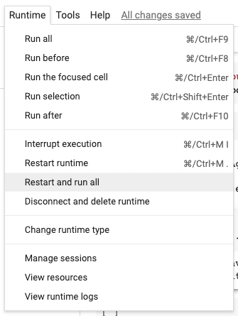

# Lab 3: Data cleaning and preprocessing – Part 1

# Download the titanic dataset

Please download the titanic dataset, `titanic-data-missing.csv`, from [here](https://drive.google.com/file/d/1DFNytGq9IIeZ7klRlmBh2GWBGYK3eLy8/view?usp=sharing) or the uploaded file on MyCourses.

# Task 1: Read the titanic dataset

Read and check the NaN values in each column. You may use the following code to determine the number of NaN values.

```python
# Check the number of NaN values in each column
print(data_df.isna().sum())

# Expected outputs

# PassengerId      0
# Survived         0
# Pclass           0
# Name             0
# Sex             43
# Age            177
# SibSp            0
# Parch            0
# Ticket           0
# Fare             0
# Cabin          687
# Embarked         2
# dtype: int64
```

# Task 2: Handle Missing `Age`

To prevent the `fillna` to change the original data, we typically create a copy of the original data to study which `fillna` technique works best before actually applying it to the original data.

Please use the following code to create a temporary DataFrame to try different `fillna` approaches.

```python
# Making a copy of our dataframe using copy
df2 = data_df.copy()
```

## Task 2.1: Fill in age by a zero value

You can check the number of NaN values and the mean of the `Age` with the following code.

```python
print(df2.isna().sum())
print(df2['Age'].mean())

# Expected outputs

# PassengerId      0
# Survived         0
# Pclass           0
# Name             0
# Sex             43
# Age              0
# SibSp            0
# Parch            0
# Ticket           0
# Fare             0
# Cabin          687
# Embarked         2
# dtype: int64
# 23.79929292929293
```

## Task 2.2: Fill in age by the mean

You can check the number of NaN values and the mean of the `Age` with the following code.

```python
print(df2.isna().sum())
print(df2['Age'].mean())

# Expected outputs

# PassengerId      0
# Survived         0
# Pclass           0
# Name             0
# Sex             43
# Age              0
# SibSp            0
# Parch            0
# Ticket           0
# Fare             0
# Cabin          687
# Embarked         2
# dtype: int64
# 29.69911764705882
```

## Task 2.3: Fill in age by the `IterativeImputer`

The following code is an example of using the [`IterativeImputer`](https://scikit-learn.org/stable/modules/generated/sklearn.impute.IterativeImputer.html) to fill in the NaN values based on the other numerical columns.

```python
from sklearn.experimental import enable_iterative_imputer
from sklearn.impute import IterativeImputer

# Use an imputer from scikit-learn
imp = IterativeImputer(max_iter=10, random_state=0)

# Create missing data
df = pd.DataFrame([[1, 2], [3, 6], [4, 8], [np.nan, 3], [7, np.nan]])

# Models each feature with missing values as a function of other features
imp.fit(df)

# The model learns that the second feature is double the first
nonan_np = imp.transform(df)

# As the output of the `transform` function returns numpy.array,
# you need to convert it back to the DataFrame
nonan_df = pd.DataFrame(nonan_np)
```

<aside>
⚠️

[`IterativeImputer`](https://scikit-learn.org/stable/modules/generated/sklearn.impute.IterativeImputer.html) from `scikit-learn` **ONLY** support the numerical columns. You MUST select only the numerical columns of interests before run `fit` function. Also when filling the values with `transform`, you also need to select the same numerical columns.

</aside>

<aside>
☝🏻 **Hint**: the numerical columns of the DataFrame can be determined by using `info` function.

```python
data_df.info()
```

</aside>

Please note that you **DO NOT** need to use all numerical columns. You **MUST** select only the ones that would correlate well with the `'Age'` values.

```python
print(df2.isna().sum())
print(df2['Age'].mean())

# Expected outputs

# PassengerId      0
# Survived         0
# Pclass           0
# Name             0
# Sex             43
# Age              0
# SibSp            0
# Parch            0
# Ticket           0
# Fare             0
# Cabin          687
# Embarked         2
# dtype: int64
# 29.314779232473434
```

## Task 2.4: Which one is the best method to handle the missing age data? and why?

Please provide your answer as a text cell in the notebook.

# Task 3: Handle Missing `Embarked`

## Task 3.1: Remove passengers (i.e., rows) whose `'Embarked'` are unknown

You can check the number of NaN values and the number of remaining passengers with the following code.

```python
print(df2.isnull().sum())
print(len(df2))

# Expected outputs

# PassengerId      0
# Survived         0
# Pclass           0
# Name             0
# Sex             43
# Age            177
# SibSp            0
# Parch            0
# Ticket           0
# Fare             0
# Cabin          687
# Embarked         0
# dtype: int64
# 889
```

## Task 3.2: Fill in the missing `Embarked` with the mode value

You can check the number of NaN values, the mode of `'Embarked'`, and the number of remaining passengers with the following code.

```python
print(df2.isnull().sum())
print(embarked_mode)
print(len(df2))

# Expected outputs

# PassengerId      0
# Survived         0
# Pclass           0
# Name             0
# Sex             43
# Age            177
# SibSp            0
# Parch            0
# Ticket           0
# Fare             0
# Cabin          687
# Embarked         0
# dtype: int64
# S
# 891
```

<aside>
☝🏻 **Hint:** You may find the following code that determines the mode of the `'ColumnA'` in the `df` useful.

```python
column_a_mode = df['ColumnA'].mode().values[0]
```

</aside>

## Task 3.3: Which one is the best method to handle the missing embarked data? and why?

Please provide your answer as a text cell in the notebook.

# Task 4: Handle Missing `Cabin`

## Task 4.1: Fill in the missing `Cabin` with the mode value

You can check the number of NaN values, the mode of `'Cabin'`, and the frequencies of each unique values of the `'Cabin'` column.

```python
print(df2.isnull().sum())
print(cabin_mode)
print(df2['Cabin'].value_counts())

# Expected outputs

# PassengerId      0
# Survived         0
# Pclass           0
# Name             0
# Sex             43
# Age            177
# SibSp            0
# Parch            0
# Ticket           0
# Fare             0
# Cabin            0
# Embarked         2
# dtype: int64
# B96 B98
# B96 B98        691
# G6               4
# C23 C25 C27      4
# C22 C26          3
# F33              3
#               ... 
# E34              1
# C7               1
# C54              1
# E36              1
# C148             1
# Name: Cabin, Length: 147, dtype: int64
```

## Task 4.2: Fill in the missing cabin with `'UNK’`

You can check the number of NaN values and the frequencies of each unique value of the `'Cabin'` column.

```python
print(df2.isnull().sum())
print(df2['Cabin'].value_counts())

# Expected outputs

# PassengerId      0
# Survived         0
# Pclass           0
# Name             0
# Sex             43
# Age            177
# SibSp            0
# Parch            0
# Ticket           0
# Fare             0
# Cabin            0
# Embarked         2
# dtype: int64
# UNK            687
# C23 C25 C27      4
# G6               4
# B96 B98          4
# C22 C26          3
#               ... 
# E34              1
# C7               1
# C54              1
# E36              1
# C148             1
# Name: Cabin, Length: 148, dtype: int64
```

## Task 4.3: Which one is the best method to handle the missing cabin data? and why?

Please provide your answer as a text cell in the notebook.

# Task 5: Use the best approach from Task 2 to Task 4 to clean `Age`, `Embarked`, `Cabin`

Based on your answers in **Task 2 to Task 4**, please use the best approach to fill in the missing `'Age'`, `'Embarked'`, and `'Cabin'`, and save as a new DataFrame, named `clean_df`.

```python
print(clean_df.isna().sum())

# Expected outputs

# PassengerId     0
# Survived        0
# Pclass          0
# Name            0
# Sex            43
# Age             0
# SibSp           0
# Parch           0
# Ticket          0
# Fare            0
# Cabin           0
# Embarked        0
# dtype: int64
```

# Task 6: Handle Missing `Sex`

Fortunately, the `'Name'` column in the dataset does not contain any missing values, and they have the title of the passenger that can be used to guess their sex. 

Please create a custom function, named `extract_sex`, to be used with the `map` or `apply` function to fill in the missing `Sex` based on each passenger title. 

> Note that you need to skip the passenger whose ages are not missing.
> 

Please use the following dictionary for mapping between the title and the sex.

```python
name2sex = {
    'Mr.' : 'male',
    'Mrs.': 'female',
    'Miss.' : 'female',
    'Mme': 'female',
    'Dr.': 'male',
    'Master': 'male',
}
```

```python
print(clean_df.loc[data_df['Sex'].isna(), 'Sex'])
print(clean_df.isna().sum())
print(clean_df['Sex'].value_counts())

# Expected outputs

# 13       male
# 20       male
# 39     female
# 67       male
# 74       male
# 100    female
# 103      male
# 124      male
# 152      male
# 157      male
# 160      male
# 171      male
# 210      male
# 245      male
# 312    female
# 334    female
# 344      male
# 356    female
# 369    female
# 379      male
# 386      male
# 391      male
# 410      male
# 427    female
# 440    female
# 455      male
# 475      male
# 499      male
# 502    female
# 528      male
# 563      male
# 606      male
# 630      male
# 636      male
# 681      male
# 685      male
# 711      male
# 718      male
# 727    female
# 732      male
# 784      male
# 888    female
# 890      male
# Name: Sex, dtype: object
# PassengerId    0
# Survived       0
# Pclass         0
# Name           0
# Sex            0
# Age            0
# SibSp          0
# Parch          0
# Ticket         0
# Fare           0
# Cabin          0
# Embarked       0
# dtype: int64
# male      577
# female    312
# Name: Sex, dtype: int64
```

# Task 7: Replace `Pclass`

Please replace the `'Pclass'` column with the following mapping:

```python
pclass_name = {
    1: 'first', 
		2: 'second',
		3: 'third'
}
```

```python
print(clean_df['Pclass'].value_counts())

# Expected outputs

# third     491
# first     214
# second    184
# Name: Pclass, dtype: int64
```

# Task 8: Binning the age to create `Age_group`

Please use the binning technique to create a new column, named `'Age_group'`, based on the following age range:

- (17-25]: Youth
- (25-60]: Adult
- (60-100]: Elderly
- Others: NaN

```python
print(clean_df['Age_group'].value_counts())

# Expected outputs
# Note: the outputs may vary depending on your choice of filling values for age

# Adult      545
# Youth      203
# Elderly     21
# Name: Age_group, dtype: int64
```

# Submission

**Deadline: Monday 24 August 2026 @ 23:55**

Please submit **two** files to MyCourse.

1. `lab3_<StudentID>.ipynb`
2. `lab3_<StudentID>.html`

## To convert to a HTML file - Ubuntu ONLY

1. Install a jupyter notebook converter.
    
    ```bash
    sudo apt install jupyter-nbconvert
    ```
    
2. Run a convert command.
    
    ```bash
    jupyter-nbconvert --to html lec1_<StudentID>.ipynb
    ```
    

## Generate HTML from Google Colab Notebook - At Home

1. Upload your .ipynb file to Google Colab
2. Re-run every code to generate outputs in the notebook
    
    
    
3. Download your notebook as .ipynb to your local machine
    
    
    
4. Upload your notebook to the google colab
    
    
    
5. Run the following command to generate a HTML file
    
    ```bash
    %%shell
    jupyter nbconvert --to html /content/lec05.ipynb
    ```
    
6. Download the HTML file
    
    