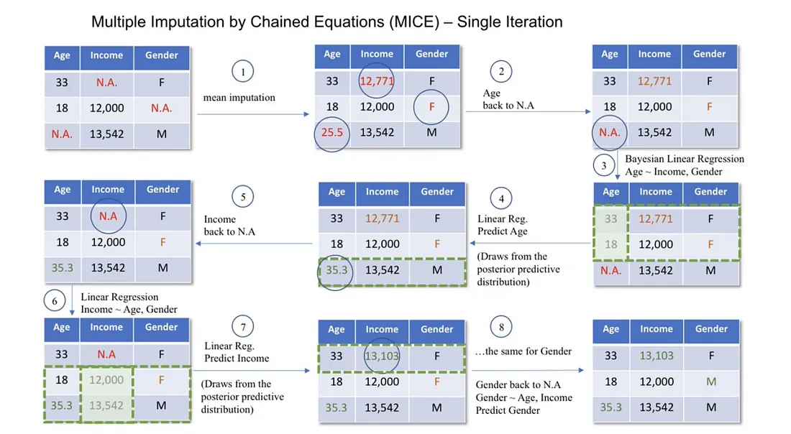

# Lecture 3: Data cleaning and preprocessing – Part 1 (2026)


# Why Data Cleaning (or Data Cleansing)?

During the course of doing data analysis and modeling, a significant amount of time is spent on data preparation: loading, cleaning, transforming, and rearranging. Such tasks are often reported to take up **80% or more** of an analyst’s time.

Typically the way that data is stored in files or databases is **NOT** in the right format for a particular task. Many researchers choose to do ad hoc processing of data from one form to another using a general-purpose programming language, like Python, Perl, R, or Java, or Unix text-processing tools.

<aside>
⚠️ It is important to note that there are other techniques, not mentioned in this lecture, that can also be used.

</aside>

# Handling Missing Data

Missing data occurs commonly in many data analysis applications. One of the goals of pandas is to make working with missing data as painless as possible. For example, all of the descriptive statistics on pandas objects exclude missing data by default.

<aside>
⚠️ When not appropriately handled, missing data can bias the conclusions of all the statistical analyses on the data, leading the business to make wrong decisions.

</aside>

Create a Series with a missing (or null) value:

```python
float_data = pd.Series([1.2, -3.5, np.nan, 0])

print(float_data)

# 0    1.2
# 1   -3.5
# 2    NaN
# 3    0.0
# dtype: float64
```

The `isna` method gives us a Boolean Series with `True` where values are null:

```python
print(float_data.isna())

# 0    False
# 1    False
# 2     True
# 3    False
# dtype: bool
```

The built-in Python `None` value is also treated as NA:

```python
string_data = pd.Series(["aardvark", np.nan, None, "avocado"])

print(string_data)

# 0    aardvark
# 1         NaN
# 2        None
# 3     avocado
# dtype: object

print(string_data.isna())

# 0    False
# 1     True
# 2     True
# 3    False
# dtype: bool

float_data = pd.Series([1, 2, None], dtype='float64')

print(float_data)

# dtype: bool
# 0    1.0
# 1    2.0
# 2    NaN
# dtype: float64

print(float_data.isna())

# dtype: float64
# 0    False
# 1    False
# 2     True
# dtype: bool
```

See the table below for a list of some functions related to missing data handling.

| **Method** | **Description** |
| --- | --- |
| `dropna` | Filter axis labels based on whether values for each label have missing data, with varying thresholds for how much missing data to tolerate. |
| `fillna` | Fill in missing data with some value or using an interpolation method such as `"ffill"` or `"bfill"`. |
| `isna` | Return Boolean values indicating which values are missing/NA. |
| `notna` | Negation of `isna`, returns `True` for non-NA values and `False` for NA values. |

## Determine Types of Missing Data

1. **ข้อมูลสูญหายแบบสุ่มสมบูรณ์: Missing completely at random (MCAR).** This happens if all the variables and observations have the same probability of being missing.
    
    เช่น แบบสอบถามเพศ และน้ำหนัก มีบางคนลืมตอบคำถามพอดี การหายไปของข้อมูลน้ำหนักจึงเกิดขึ้นแบบสุ่ม โดยที่ไม่สัมพันธ์กับตัวแปรอื่นใดเลย
    
2. **ข้อมูลสูญหายแบบสุ่ม: Missing at random (MAR)**. The probability of the value being missing is related to the value of the variable or other variables in the dataset. This means that *not all the observations and variables have the same chance of being missing*. An example of MAR is a survey in the Data community where data scientists who do not frequently upgrade their skills are more likely not to be aware of new state-of-the-art algorithms or technologies, hence skipping certain questions. In this case, the missing data is related to how frequently the data scientist upskills.
    
    เช่น แบบสอบถามเพศ และน้ำหนัก พบว่า ผู้หญิงมักจะไม่ค่อยตอบเรื่องน้ำหนัก (การไม่ตอบน้ำหนัก ขึ้นอยู่กับเพศ ซึ่งเป็นอีกตัวแปรหนึ่ง)
    
3. **ข้อมูลสูญหายแบบไม่สุ่ม: Missing not at random (MNAR).** MNAR is considered to be the most difficult scenario among the three types of missing data. It is applied when neither MAR nor MCAR apply. In this situation, *the probability of being missing is completely different for different values of the same variable, and these reasons can be unknown to us*. An example of MNAR is a survey about married couples. Couples with a bad relationship might not want to answer certain questions as they might feel embarrassed to do so.
    
    เช่น แบบสอบถามเพศและน้ำหนัก พบว่ามีการไม่ตอบช่องน้ำหนักในบางคน และนั่นอาจจะเป็นเพราะผู้ตอบมีน้ำหนักมาก (การไม่ตอบน้ำหนักขึ้นอยู่กับค่าน้ำหนักเอง ซึ่งจริงๆก็บอกไม่ได้ว่าสมมติฐานเราถูกไหม)
    

<aside>
☝🏻 There is no standard way that can be used to determine these types. It is important that you consult the domain experts for insights into what could be the causes of missing data.

</aside>

## Filtering Out Missing Data

```python
data = pd.Series([1, np.nan, 3.5, np.nan, 7])

print(data.dropna())

# 0    1.0
# 2    3.5
# 4    7.0
# dtype: float64
```

This is the same thing as doing:

```python
print(data[data.notna()])

# 0    1.0
# 2    3.5
# 4    7.0
# dtype: float64
```

With DataFrame objects, there are different ways to remove missing data.

```python
data = pd.DataFrame([
    [1., 6.5, 3.],
    [1., np.nan, np.nan],
    [np.nan, np.nan, np.nan],
    [np.nan, 6.5, 3.]
], columns=['c1','c2','c3'])

print(data)

#     c1   c2   c3
# 0  1.0  6.5  3.0
# 1  1.0  NaN  NaN
# 2  NaN  NaN  NaN
# 3  NaN  6.5  3.0

print(data.dropna())

#     c1   c2   c3
# 0  1.0  6.5  3.0
```

Passing `how="all"` will drop only rows that are all NA:

```python
print(data.dropna(how="all"))

#     c1   c2   c3
# 0  1.0  6.5  3.0
# 1  1.0  NaN  NaN
# 3  NaN  6.5  3.0
```

To drop rows that contains NaN in **some** columns, you can specify the list of considered columns in `subset`.

```python
print(data.dropna(subset=['c3']))

#     c1   c2   c3
# 0  1.0  6.5  3.0
# 3  NaN  6.5  3.0

print(data.dropna(subset=['c1','c2']))

#     c1   c2   c3
# 0  1.0  6.5  3.0
```

Keep in mind that the `dropna` function returns new objects by default and does not modify the contents of the original object. To make the drop persist, you can reassign the returned DataFrame to a new variable.

```python
data = data.dropna(subset=['c1','c2'])
```

To drop columns in the same way, pass `axis="columns"` or `axis=1`:

```python
# Modify the data to have one column containing all NaN values
data[4] = np.nan

print(data)

#      0    1    2   4
# 0  1.0  6.5  3.0 NaN
# 1  1.0  NaN  NaN NaN
# 2  NaN  NaN  NaN NaN
# 3  NaN  6.5  3.0 NaN

print(data.dropna(axis="columns", how="all"))

#      0    1    2
# 0  1.0  6.5  3.0
# 1  1.0  NaN  NaN
# 2  NaN  NaN  NaN
# 3  NaN  6.5  3.0

print(data.dropna(axis=1, how="all"))

#      0    1    2
# 0  1.0  6.5  3.0
# 1  1.0  NaN  NaN
# 2  NaN  NaN  NaN
# 3  NaN  6.5  3.0
```

Suppose you want to keep only rows containing, at most, a certain number of missing observations. You can indicate this with the `thresh` argument:

```python
df = pd.DataFrame(np.random.standard_normal((7, 3)))
df = df.rename(columns={0:'col1', 1:'col2', 2:'col3'})

# Simulate missing data
df.iloc[:4, 1] = np.nan
df.iloc[:2, 2] = np.nan

print(df)

#        col1      col2      col3
# 0  0.079280       NaN       NaN
# 1 -0.252995       NaN       NaN
# 2  0.859775       NaN  0.412239
# 3  0.020907       NaN -0.940454
# 4 -1.079114 -0.459818  0.599155
# 5  0.493447 -0.072785 -0.670915
# 6 -1.340642  1.181872  2.392884

print(df.dropna())

#        col1      col2      col3
# 4 -1.079114 -0.459818  0.599155
# 5  0.493447 -0.072785 -0.670915
# 6 -1.340642  1.181872  2.392884

print(df.dropna(thresh=2))  # Require 2 non-NA values in each row.

#        col1      col2      col3
# 2  0.859775       NaN  0.412239
# 3  0.020907       NaN -0.940454
# 4 -1.079114 -0.459818  0.599155
# 5  0.493447 -0.072785 -0.670915
# 6 -1.340642  1.181872  2.392884

print(df.dropna(thresh=4, axis=1))  # Require 4 non-NA values in each column.

#        col1      col3
# 0  0.079280       NaN
# 1 -0.252995       NaN
# 2  0.859775  0.412239
# 3  0.020907 -0.940454
# 4 -1.079114  0.599155
# 5  0.493447 -0.670915
# 6 -1.340642  2.392884
```

**Pros**

- Straightforward and simple to use.
- Beneficial when missing values have no importance.

**Cons**

- Using this approach can lead to information loss, which can introduce bias to the final dataset.
- This is NOT appropriate when the data is NOT missing completely at random (MCAR).
- The dataset with a large proportion of missing values can be significantly decreased, which can impact the result of all statistical analyses on that data set.

## Data Imputation (i.e., Fill in Missing Data)

Rather than filtering out missing data (and potentially discarding other data along with it), you may want to fill in the “holes” in any number of ways. For most purposes, the `fillna` method is the workhorse function to use.

See the table below for a reference on `fillna` function arguments.

| **Argument** | **Description** |
| --- | --- |
| `value` | Scalar value or dictionary-like object to use to fill in missing values |
| `method` | Interpolation method: one of `"bfill"` (backward fill) or `"ffill"` (forward fill); default is `None` |
| `axis` | Axis to fill on (`"index"` or `"columns"`); default is `axis="index"` |
| `limit` | For forward and backward filling, the maximum number of consecutive periods to fill |

### Constant value

```python
print(df)

#        col1      col2      col3
# 0  0.079280       NaN       NaN
# 1 -0.252995       NaN       NaN
# 2  0.859775       NaN  0.412239
# 3  0.020907       NaN -0.940454
# 4 -1.079114 -0.459818  0.599155
# 5  0.493447 -0.072785 -0.670915
# 6 -1.340642  1.181872  2.392884

print(df.fillna(0))

#        col1      col2      col3
# 0  0.079280  0.000000  0.000000
# 1 -0.252995  0.000000  0.000000
# 2  0.859775  0.000000  0.412239
# 3  0.020907  0.000000 -0.940454
# 4 -1.079114 -0.459818  0.599155
# 5  0.493447 -0.072785 -0.670915
# 6 -1.340642  1.181872  2.392884
```

Calling `fillna` with a dictionary, you can use a different fill value for each column using the column names:

```python
print(df.fillna({'col2': -42, 'col3': 42}))

#        col1       col2       col3
# 0 -1.316333 -42.000000  42.000000
# 1 -1.307624 -42.000000  42.000000
# 2 -0.309127 -42.000000  -0.453133
# 3 -1.439308 -42.000000   0.186330
# 4  0.521143  -0.679265   1.877537
# 5  0.707555   0.918440   0.710494
# 6 -0.695755   0.484947   0.176545
```

### Interpolation

You can use `method='ffill'` to fill NA/NaN values by propagating the last valid observation to the next valid.

```python
df = pd.DataFrame(np.random.standard_normal((6, 3)))
df = df.rename(columns={0:'col1', 1:'col2', 2:'col3'})

# Simulate missing data
df.iloc[2:, 1] = np.nan
df.iloc[4:, 2] = np.nan

print(df)

#        col1      col2      col3
# 0 -0.449592  1.017390 -0.272525
# 1 -1.286329  0.570712 -0.207765
# 2 -0.012905       NaN  0.473435
# 3  1.487922       NaN -1.165472
# 4  0.387012       NaN       NaN
# 5 -1.306142       NaN       NaN

print(df.fillna(method="ffill"))

#        col1      col2      col3
# 0 -0.449592  1.017390 -0.272525
# 1 -1.286329  0.570712 -0.207765
# 2 -0.012905  0.570712  0.473435
# 3  1.487922  0.570712 -1.165472
# 4  0.387012  0.570712 -1.165472
# 5 -1.306142  0.570712 -1.165472

print(df.fillna(method="ffill", limit=2))

#        col1      col2      col3
# 0 -0.449592  1.017390 -0.272525
# 1 -1.286329  0.570712 -0.207765
# 2 -0.012905  0.570712  0.473435
# 3  1.487922  0.570712 -1.165472
# 4  0.387012       NaN -1.165472
# 5 -1.306142       NaN -1.165472
```

You can also use `interpolate` to fill NaN values using an interpolation method.

```python
df = pd.DataFrame([
        (0.0, np.nan, -1.0, 1.0),
        (np.nan, 2.0, np.nan, np.nan),
        (2.0, 3.0, np.nan, 9.0),
        (np.nan, 4.0, -4.0, 16.0)
    ],
    columns=list('abcd'))
print(df)

#      a    b    c     d
# 0  0.0  NaN -1.0   1.0
# 1  NaN  2.0  NaN   NaN
# 2  2.0  3.0  NaN   9.0
# 3  NaN  4.0 -4.0  16.0

print(df.interpolate(method='linear', axis=0))

#      a    b    c     d
# 0  0.0  NaN -1.0   1.0
# 1  1.0  2.0 -2.0   5.0
# 2  2.0  3.0 -3.0   9.0
# 3  2.0  4.0 -4.0  16.0

print(df.interpolate(method='linear', limit_direction='backward', axis=0))

#      a    b    c     d
# 0  0.0  2.0 -1.0   1.0
# 1  1.0  2.0 -2.0   5.0
# 2  2.0  3.0 -3.0   9.0
# 3  NaN  4.0 -4.0  16.0

print(df['d'].interpolate(method='polynomial', order=2))

# 0     1.0
# 1     4.0
# 2     9.0
# 3    16.0
# Name: d, dtype: float64
```

### Basic statistics (e.g., mean, median, etc.)

```python
df = pd.DataFrame(np.random.standard_normal((6, 3)))
df = df.rename(columns={0:'col1', 1:'col2', 2:'col3'})

# Simulate missing data
df.iloc[2:, 1] = np.nan
df.iloc[4:, 2] = np.nan

print(df)

#        col1      col2      col3
# 0  0.483429 -1.670035  0.324229
# 1 -1.259032  0.828674  0.646410
# 2  0.430377       NaN  1.022465
# 3 -0.184810       NaN  0.764801
# 4 -0.474975       NaN       NaN
# 5 -1.776117       NaN       NaN

print(df.fillna(df.mean()))

#        col1      col2      col3
# 0  0.483429 -1.670035  0.324229
# 1 -1.259032  0.828674  0.646410
# 2  0.430377 -0.420680  1.022465
# 3 -0.184810 -0.420680  0.764801
# 4 -0.474975 -0.420680  0.689476
# 5 -1.776117 -0.420680  0.689476
```

**Pros**

- Simplicity and ease of implementation are some of the benefits of the mean and median imputation.
- The imputation is performed using the existing information from the non-missing data; hence, no additional data is required.
- *Mean* and *median* imputation can provide a good estimate of the missing values, respectively, for normally distributed data and skewed data.

**Cons**

- We cannot apply these two strategies to categorical columns. They can only work for numerical ones.
- Mean imputation is sensitive to outliers and may not be a good representation of the central tendency of the data. Similarly to the mean, the median also may not better represent the central tendency.
- Median imputation makes the assumption that the data is missing completely at random (MCAR), which is not always true.

### Advanced Data Imputation with Third-Party Libraries

A more sophisticated approach is to use the [**`IterativeImputer`**](https://scikit-learn.org/stable/modules/generated/sklearn.impute.IterativeImputer.html#sklearn.impute.IterativeImputer) class, which models each feature with missing values as a function of other features, and uses that estimate for imputation. It does so in an iterated round-robin fashion: at each step, a feature column is designated as output `y` and the other feature columns are treated as inputs `X`. A regressor is fit on `(X, y)` for known `y`. Then, the regressor is used to predict the missing values of `y`. This is done for each feature in an iterative fashion and then is repeated for `max_iter` imputation rounds. The results of the final imputation round are returned.



Image Source: [https://lengyi.medium.com/missing-values-multiple-imputation-by-chained-equations-da7abeb33b30](https://lengyi.medium.com/missing-values-multiple-imputation-by-chained-equations-da7abeb33b30)

```python
from sklearn.experimental import enable_iterative_imputer
from sklearn.impute import IterativeImputer

# Use an imputer from scikit-learn
imp = IterativeImputer(max_iter=10, random_state=0)

# Create missing data
df = pd.DataFrame(
	[[1, 2], [3, 6], [4, 8], [np.nan, 3], [7, np.nan]],
	columns=['k1','k2'])

print(df)

#     k1   k2
# 0  1.0  2.0
# 1  3.0  6.0
# 2  4.0  8.0
# 3  NaN  3.0
# 4  7.0  NaN

# Models each feature with missing values as a function of other features
imp.fit(df)

# The model learns that the second feature is double the first
nonan_np = imp.transform(df)

# As the output of the `transform` function returns numpy.array,
# you need to convert it back to the DataFrame
nonan_df = pd.DataFrame(nonan_np, columns=df.columns)

print(nonan_df)

#          k1         k2
# 0  1.000000   2.000000
# 1  3.000000   6.000000
# 2  4.000000   8.000000
# 3  1.500045   3.000000
# 4  7.000000  14.000041
```

Let’s use the fitted imputer for new missing data.

```python
new_df = pd.DataFrame(
    [[np.nan, 2], [6, np.nan], [np.nan, 6]],
    columns=['k1','k2'])

print(new_df)

#     k1   k2
# 0  NaN  2.0
# 1  6.0  NaN
# 2  NaN  6.0

# The model learns that the second feature is double the first
nonan_np = imp.transform(new_df)

# As the output of the `transform` function returns numpy.array,
# you need to convert it back to the DataFrame
nonan_df = pd.DataFrame(nonan_np, columns=new_df.columns)

print(nonan_df)

#          k1         k2
# 0  1.000073   2.000000
# 1  6.000000  12.000028
# 2  2.999961   6.000000
```

You can read more of the other techniques [here](https://scikit-learn.org/stable/modules/impute.html).

**Pros**

- Multiple imputation is powerful at dealing with missing data in multiple variables and multiple data types.
- The approach can produce much better results than mean and median imputations.
- Many other algorithms, such as [**K-Nearest Neighbors**](https://www.datacamp.com/tutorial/k-nearest-neighbor-classification-scikit-learn), Random forest, and [**neural networks**](https://www.datacamp.com/tutorial/neural-network-models-r), can be used as the backbone of the multiple imputation prediction for making predictions.

**Cons**

- Multiple imputation assumes that the data is missing at random (MAR).
- Despite all the benefits, this approach can be *computationally expensive* compared to other techniques, especially when working with large datasets.
- This approach requires more effort than the previous ones.

### Best Practice

There are multiple imputation strategies, and they should NOT be used blindly. Adopting the right approach can save from introducing bias in the data and making wrong decisions.

The following table illustrates which imputation method to use based on the type of missing data. The list of methods is not exhaustive, but these are the most commonly used.

| **Type of missing data** | **Imputation method** |
| --- | --- |
| Missing Completely At Random | Mean, Median, Mode, or any other imputation method |
| Missing At Random | Multiple imputation, Regression imputation |
| Missing Not At Random | Pattern Substitution, Maximum Likelihood estimation |

### Assessing the impact of imputation on the overall analysis

It is important to keep in mind that the original data **CANNOT** be recovered no matter the imputation technique. However, it is possible to use techniques that can generate imputed data sets that are as close as possible to reality.

Below are a few key steps to consider during the assessment.

- Run multiple imputation techniques to identify the most robust one. This can help identify any bias and variations from one technique to another.
- Compare the final imputed data to the original non-imputed data to assess the reliability of the imputation method.
- Include the imputation process in the overall analysis pipeline from data cleaning to building any machine learning model.

### Communicating missing data and imputation methods to stakeholders

Having good quality data is the goal of any stakeholders and data practitioners.

Honesty and transparency are key when communicating data missing from the analysis. Below are some important aspects to consider.

- Be aware of the context of the missing data, whether it is MCAR, MAR, or MNAR.
- Clearly explain and document the methods used to tackle the data missing from the overall data and discuss the benefits and drawbacks of each approach.
- Communicate the results in a way that can be understood by stakeholders.

# Data Transformation

## Remove Duplicates

Duplicate rows may be found in a DataFrame for any number of reasons. Here is an example:

```python
data = pd.DataFrame({
    "k1": ["one", "two"] * 3 + ["two"],
    "k2": [1, 1, 1, 3, 3, 4, 4]
})

print(data)

#     k1  k2
# 0  one   1
# 1  two   1
# 2  one   1
# 3  two   3
# 4  one   3
# 5  two   4
# 6  two   4
```

The DataFrame method `duplicated` returns a Boolean Series indicating whether each row is a duplicate (its column values are exactly equal to those in an earlier row) or not:

```python
print(data.duplicated())

# 0    False
# 1    False
# 2     True
# 3    False
# 4    False
# 5    False
# 6     True
# dtype: bool
```

Relatedly, `drop_duplicates` returns a DataFrame with rows where the `duplicated` array is `False` filtered out:

```python
print(data.drop_duplicates())

#     k1  k2
# 0  one   1
# 1  two   1
# 3  two   3
# 4  one   3
# 5  two   4
```

Both methods by default consider all of the columns; alternatively, you can specify any subset of them to detect duplicates. Suppose we had an additional column of values and wanted to filter duplicates based only on the `"k1"` column:

```python
data["v1"] = range(7)

print(data)

#     k1  k2  v1
# 0  one   1   0
# 1  two   1   1
# 2  one   1   2
# 3  two   3   3
# 4  one   3   4
# 5  two   4   5
# 6  two   4   6

print(data.drop_duplicates(subset=["k1"]))

#     k1  k2  v1
# 0  one   1   0
# 1  two   1   1
```

`duplicated` and `drop_duplicates` by default keep the *first* observed value combination. Passing `keep="last"` will return the last one:

```python
print(data.drop_duplicates(["k1", "k2"], keep="last"))

#     k1  k2  v1
# 1  two   1   1
# 2  one   1   2
# 3  two   3   3
# 4  one   3   4
# 6  two   4   6
```

## Transform Data using a Function or Mapping

For many datasets, you may wish to perform some transformation based on the values in an array, Series, or column in a DataFrame. Consider the following hypothetical data collected about various kinds of meat:

```python
data = pd.DataFrame({"food": ["bacon", "pulled pork", "bacon",
                       "pastrami", "corned beef", "bacon",
                       "pastrami", "honey ham", "nova lox"],
              "ounces": [4, 3, 12, 6, 7.5, 8, 3, 5, 6]})

print(data)

#           food  ounces
# 0        bacon     4.0
# 1  pulled pork     3.0
# 2        bacon    12.0
# 3     pastrami     6.0
# 4  corned beef     7.5
# 5        bacon     8.0
# 6     pastrami     3.0
# 7    honey ham     5.0
# 8     nova lox     6.0
```

Suppose you wanted to add a column indicating the type of animal that each food came from. Here we define a mapping of each distinct meat type to the kind of animal in the dictionary `mean_to_animal`. The `map` method on a Series accepts a function or dictionary-like object containing a mapping to do the transformation of values:

```python
meat_to_animal = {
  "bacon": "pig",
  "pulled pork": "pig",
  "pastrami": "cow",
  "corned beef": "cow",
  "honey ham": "pig",
  "nova lox": "salmon"
}

data["animal"] = data["food"].map(meat_to_animal)

print(data)

#           food  ounces  animal
# 0        bacon     4.0     pig
# 1  pulled pork     3.0     pig
# 2        bacon    12.0     pig
# 3     pastrami     6.0     cow
# 4  corned beef     7.5     cow
# 5        bacon     8.0     pig
# 6     pastrami     3.0     cow
# 7    honey ham     5.0     pig
# 8     nova lox     6.0  salmon
```

We could also have passed a function that does all the work:

```python
def get_animal(x):
    if 'bacon' in x.lower() or 'pork' in x.lower() or 'ham' in x.lower():
        return 'pig'
    else:
        return 'non-pig'

data['animal2'] = data["food"].map(get_animal)

print(data)

#           food  ounces  animal  animal2
# 0        bacon     4.0     pig      pig
# 1  pulled pork     3.0     pig      pig
# 2        bacon    12.0     pig      pig
# 3     pastrami     6.0     cow  non-pig
# 4  corned beef     7.5     cow  non-pig
# 5        bacon     8.0     pig      pig
# 6     pastrami     3.0     cow  non-pig
# 7    honey ham     5.0     pig      pig
# 8     nova lox     6.0  salmon  non-pig
```

Using `map` is a convenient way to perform element-wise transformations and other data cleaning related operations.

## Replacing Values

Filling in missing data with the `fillna` method is a special case of more general value replacement. As you’ve already seen, `map` can be used to modify a subset of values in an object, but `replace` provides a simpler and more flexible way to do so. Let’s consider this Series:

```python
data = pd.Series([1., -999., 2., -999., -1000., 3.])

print(data)

# 0       1.0
# 1    -999.0
# 2       2.0
# 3    -999.0
# 4   -1000.0
# 5       3.0
# dtype: float64
```

The `-999` values might be sentinel values for missing data. To replace these with NA values that pandas understands, we can use `replace`, producing a new Series:

<aside>
⚠️ Sentinel values (e.g., 0, -999999, 999999, etc) are common in manufacturing. You should always check for these values whether they represent the missing values or not.

</aside>

```python
print(data.replace(-999, np.nan))

# 0       1.0
# 1       NaN
# 2       2.0
# 3       NaN
# 4   -1000.0
# 5       3.0
# dtype: float64
```

If you want to replace multiple values at once, you instead pass a list and then the substitute value:

```python
print(data.replace([-999, -1000], np.nan))

# 0    1.0
# 1    NaN
# 2    2.0
# 3    NaN
# 4    NaN
# 5    3.0
# dtype: float64
```

To use a different replacement for each value

- Pass a list of the corresponding substitutes, or
- Pass a mapping dictionary

```python
# List
print(data.replace([-999, -1000], [np.nan, 0]))

# 0    1.0
# 1    NaN
# 2    2.0
# 3    NaN
# 4    0.0
# 5    3.0
# dtype: float64

# Dictionary
print(data.replace({-999: np.nan, -1000: 0}))

# 0    1.0
# 1    NaN
# 2    2.0
# 3    NaN
# 4    0.0
# 5    3.0
# dtype: float64
```

## Discretization and Binning

Continuous data is often discretized or otherwise separated into “bins” for analysis. Suppose you have data about a group of people in a study, and you want to group them into discrete age buckets:

```python
ages = [20, 22, 25, 27, 21, 23, 37, 31, 61, 45, 41, 32]
```

Let’s divide these into bins of 18 to 25, 26 to 35, 36 to 60, and finally 61 and older. To do so, you have to use `pandas.cut`:

```python
bins = [18, 25, 35, 60, 100]
age_categories = pd.cut(ages, bins)

print(age_categories)

# [(18, 25], (18, 25], (18, 25], (25, 35], (18, 25], ..., (25, 35], (60, 100], (35, 60], (35, 60], (25, 35]]
# Length: 12
# Categories (4, interval[int64, right]): [(18, 25] < (25, 35] < (35, 60] < (60, 100]]
```

The object pandas returns is a special Categorical object. The output you see describes the bins computed by `pandas.cut`. Each bin is identified by a special (unique to pandas) interval value type containing the lower and upper limit of each bin:

```python
print(age_categories.codes)

# [0 0 0 1 0 0 2 1 3 2 2 1]

print(age_categories.categories)

# IntervalIndex([(18, 25], (25, 35], (35, 60], (60, 100]], dtype='interval[int64, right]')

print(age_categories.categories[0])

# (18, 25]

print(pd.value_counts(age_categories))

# (18, 25]     5
# (25, 35]     3
# (35, 60]     3
# (60, 100]    1
# dtype: int64
```

Note that `pd.value_counts(categories)` are the bin counts for the result of `pandas.cut`.

In the string representation of an interval, a parenthesis means that the side is *open* (exclusive), while the square bracket means it is *closed* (inclusive). You can change which side is closed by passing `right=False`:

```python
print(pd.cut(ages, bins, right=False))

# [[18, 25), [18, 25), [25, 35), [25, 35), [18, 25), ..., [25, 35), [60, 100), [35, 60), [35, 60), [25, 35)]
# Length: 12
# Categories (4, interval[int64, left]): [[18, 25) < [25, 35) < [35, 60) < [60, 100)]
```

You can override the default interval-based bin labeling by passing a list or array to the `labels` option:

```python
group_names = ["Youth", "YoungAdult", "MiddleAged", "Senior"]

print(pd.cut(ages, bins, labels=group_names))

# ['Youth', 'Youth', 'Youth', 'YoungAdult', 'Youth', ..., 'YoungAdult', 'Senior', 'MiddleAged', 'MiddleAged', 'YoungAdult']
# Length: 12
# Categories (4, object): ['Youth' < 'YoungAdult' < 'MiddleAged' < 'Senior']
```

If you pass an integer number of bins to `pandas.cut` instead of explicit bin edges, it will compute equal-length bins based on the minimum and maximum values in the data. Consider the list of ages chopped into fifths:

```python
print(pd.cut(ages, 5))

# [(19.959, 28.2], (19.959, 28.2], (19.959, 28.2], (19.959, 28.2], (19.959, 28.2], ..., (28.2, 36.4], (52.8, 61.0], (44.6, 52.8], (36.4, 44.6], (28.2, 36.4]]
# Length: 12
# Categories (5, interval[float64, right]): [(19.959, 28.2] < (28.2, 36.4] < (36.4, 44.6] <
#                                            (44.6, 52.8] < (52.8, 61.0]]
```

# References

- [https://wesmckinney.com/book/data-wrangling.html](https://wesmckinney.com/book/data-wrangling.html)
- [https://www.datacamp.com/tutorial/techniques-to-handle-missing-data-values](https://www.datacamp.com/tutorial/techniques-to-handle-missing-data-values)
- [https://scikit-learn.org/stable/modules/impute.html](https://scikit-learn.org/stable/modules/impute.html)
- [https://support.microsoft.com/en-au/office/top-ten-ways-to-clean-your-data-2844b620-677c-47a7-ac3e-c2e157d1db19](https://support.microsoft.com/en-au/office/top-ten-ways-to-clean-your-data-2844b620-677c-47a7-ac3e-c2e157d1db19)
- [https://www.kaggle.com/code/dnyaneshyeole/exploring-the-impact-of-imputing-cabin-variable](https://www.kaggle.com/code/dnyaneshyeole/exploring-the-impact-of-imputing-cabin-variable)